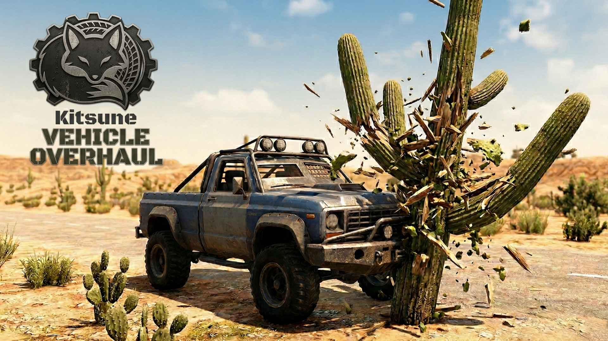

# Kitsune Vehicle Overhaul



**Your 4x4 truck weighs two tons. A cactus should not total it.**

Kitsune Vehicle Overhaul rebalances vehicle collision damage so driving through the desert doesn't feel like driving through a minefield. Cacti shatter on impact, heavier vehicles shrug off rough terrain, and you stop burning through repair kits every five minutes.

Patches **163 vehicles** across vanilla, Bdub's Vehicles, Vehicle Madness, and Witos Vehicles. All optional — install the vehicle packs you want, the mod handles the rest. Server-side only — no client install needed.

---

## What It Does

### The Cactus Fix

The big saguaro cacti (the tall ones) were missing a `VehicleHitScale` property that the small cacti already had. This meant a 20-foot cactus hit your truck like a concrete wall. We fixed that.

- **Small cacti** shatter instantly with zero damage (vanilla behavior, unchanged)
- **Large saguaros** now shatter easily and leave a tiny scratch at most — enough to hear the "thunk," not enough to care about

### Vehicle Damage Resistance

Every vehicle now has built-in collision resistance based on its weight class. This stacks with the **Intellect Mastery** perk, which already reduces vehicle self-damage by 20% per rank.

| Class | Vehicles | Damage Resistance |
|-------|----------|-------------------|
| Bicycle | Bicycle, BMX, Tricycle | -15% |
| Light | Minibike, Golf Cart, Duster, Buggy | -25% to -30% |
| Motorcycle | Motorcycle, Cruiser, Dirt Bike, Junker, Rat Bike, KTM, SuperMoto, SnowMobile | -35% |
| Car / Van | Charger, GNX, Hot Rods, Sedans, BMWs, Vans, Corsa, Willy Jeep | -40% |
| Boat | Sailboat, Motorboat, Yacht, Hovercraft, Cargo Boat | -30% |
| Truck | 4x4, Box Trucks, Semi, Trophy Truck, Buses, RV, Monster Trucks | -50% |
| Military | BRDM-2, Humvee, LMTV, MRAP, JLTV, Striker, Tanks | -60% |
| Aircraft | Gyrocopter, Cessna, Helicopters, Ospreys, Hoverbike, Jetpack | -25% |

**What this means in practice:** A vanilla 4x4 with zero perks takes full collision damage. With this mod, that same truck takes half damage before you invest a single skill point. Add a few ranks of Intellect Mastery and you're practically bulletproof.

### HP Buffs

All vehicles get a modest ~25% HP increase as a secondary buffer. This is intentionally small — the damage resistance does the heavy lifting, and we didn't want to inflate repair kit costs.

### Repairing

Repair kits work the same as vanilla. Each kit restores a flat 1,000 HP plus a percentage bonus from Intellect Mastery. Because the HP buffs are modest, you'll need at most 1-2 extra kits compared to vanilla on a full repair from zero — and since you're taking less damage in the first place, you'll repair less often overall.

---

## Supported Vehicles

**163 vehicles total** across 4 mod packs (all optional except vanilla):

### Vanilla (5)
Bicycle, Minibike, Motorcycle, 4x4 Truck, Gyrocopter

### Bdub's Vehicles (35) — *supported, not required*
- **Old Variants (5):** Old Bicycle, Old Minibike, Old Motorcycle, Old 4x4, Old Gyrocopter
- **Motorcycles (4):** Cruiser, Dirt Bike, Junker, Rat Bike
- **Light (3):** Golf Cart, Duster, Buggy
- **Cars (10):** Charger, GNX, Hot Rod 1-6, Nova, Stallion, Pickup, Willy Jeep
- **Trucks (7):** Box Truck (Plain), Box Truck (Hostess), Old Semi, Trophy Truck, Work Truck, SHERP, UAZ-452
- **Military (7):** BRDM-2 (x3), Humvee, LMTV, Marauder, MRAP
- **Aircraft (2):** MD-500, UH-60 Black Hawk

### Vehicle Madness (69) — *supported, not required*
- **Motorcycles/Light (7):** Quad (x2), MotoGuppy, Vespa, Vespakart, Caterham
- **Sedans/Cars (22):** Sedan, Rusty Sedan, Taxi, BMWs, Beetle, Cutlass, Fairlane, OldsMobile, Station Wagon, Combis, Camaro, Police Car, Small Pickup, Jeep C, Junker Mustang, Van Red, NPC Van, Van 2
- **Sport/Muscle (13):** Pickup, Crusader, Malice, Turbo, Veneno, Skyline GTR, Muscles, Evo Lancer, Mustang Mach 1, Interceptor, Explorer, Buggy 2
- **Trucks/Heavy (19):** Fastback, Buggy, Hunter, Spiker, RV, Flatbed, Ambulance, Box Truck, Big Rigs, Apo Truck, Trucks, Dumper Truck, Old Semi, Monster Pickup/Van, Buses
- **Military (8):** Tactical Jeep, Military HumVee, Military Trucks, M3A Truck, Armored Cobra, Warthog, Striker

### Witos Vehicles (54) — *supported, not required*
- **Bicycles (3):** Tricycle, BMX, BMX ET
- **Motorcycles (4):** KTM, SuperMoto, Naked, SnowMobile
- **Vans (15):** Corsa + 14 van variants
- **Boats (10):** Wooden Boat, Sailboat, Motorboat, CSB Boat, Bathtub Boat, Yacht (x2), Cargo Boat, Command Boat, Hovercraft
- **Aircraft (17):** Cessna (x2), Airplane, Jetpack, Drone, Hoverbike (x2), MH-6 (x3), Apache, RAH-66, UH-60, Ospreys (x3), Black Panther, CH-47
- **Heavy/Military (5):** JLTV, Crane, Tank EV2, Tank KV-II, Tank M1A2 Abrams

---

## Installation

Drop the `Kitsune Vehicle Overhaul` folder into your game's `Mods/` directory:

```
7 Days To Die/
  Mods/
    Kitsune Vehicle Overhaul/
      ModInfo.xml
      Config/
        items.xml
        blocks.xml
```

**Server-side only.** Clients don't need to install anything — configs are sent on connect.

> **Note:** You may see XPath warnings in the log for vehicle packs you don't have installed (e.g., `Could not find node for xpath` referencing Witos or Vehicle Madness items). These are harmless — the game simply skips patches for vehicles that don't exist. Your log will be clean if you have all supported packs installed.

---

## Compatibility

- **7 Days to Die V1.0+**
- **Bdub's Vehicles** — full support (optional)
- **Vehicle Madness** — full support (optional)
- **Witos Vehicles** — full support, requires WitosRoot (optional)
- **Vehicle Armor Mod / Vehicle Plow Mod** — stacks cleanly (those use `VehicleStrongSelfDamage`, we use `VehicleSelfDamage`)
- **Grease Monkey / Intellect Mastery perks** — stacks additively as intended
- **Other vehicle mods** — no conflicts, but unpatched vehicles won't receive buffs

---

## Technical Details

For modders who want to understand or tweak the values:

**Collision self-damage formula (from `EntityVehicle.OnCollisionForward`):**
```
raw_damage = max(0, speed - 1.5) * mass * 0.0583
self_damage = min(raw_damage, damage_to_block) * (2.5 / VehicleHitScale) * VehicleSelfDamage
```

**VehicleHitScale** (blocks.xml) — Per-block property. Higher value = block breaks easier AND less self-damage to vehicle. `999` = zero damage, `50` = tiny scratch, `1` = full damage (default).

**VehicleSelfDamage** (items.xml) — Passive effect on vehicle items. Multiplier on all collision self-damage. Stacks additively with Intellect Mastery (-20% per rank) and Fireman's Almanac (-25%).

**Repair formula (from `Vehicle.RepairParts`):**
```
hp_per_kit = 1000 + (max_health * intellect_mastery_rank * 0.1)
```

---

## Credits

- **Kitsune** — Mod design and balance
- **Bdub** — Bdub's Vehicles
- **Ragsy / Guppycur** — Vehicle Madness
- **Witos** — Witos Vehicles + WitosRoot
- **The Fun Pimps** — 7 Days to Die
